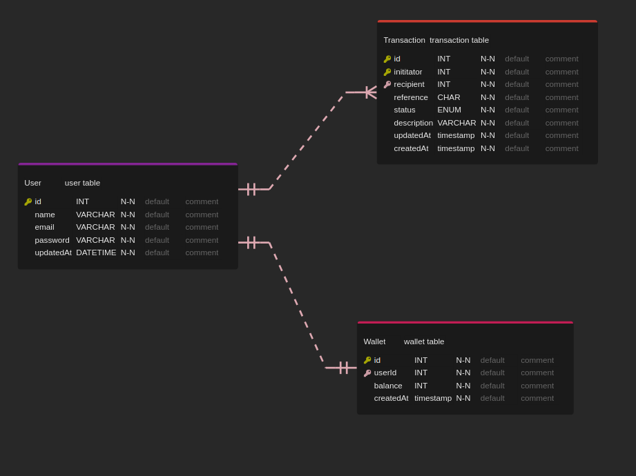

  <p align="center">Welcome to Lendsqr Demo Credit backend project API!</p>

## Description

Demo Credit is a mobile lending app that has wallet functionality for management of users funds.

## Links

- API Endpoint url - [https://ayeola-kehinde-lendsqr-be-test.herokuapp.com/](https://ayeola-kehinde-lendsqr-be-test.herokuapp.com/)

- Postman collection public URL - [https://documenter.getpostman.com/view/9115404/2s847BTvce](https://documenter.getpostman.com/view/9115404/2s847BTvce)

## Users Can

- Signup
- Login
- Fund their accounts
- Transfer funds to other users
- Rcieve funds from other users
- Withdraw their funds
- See their transaction history

## Installation

npm

```bash
$ npm install
```

env

```bash
PORT=

DB_HOST=
DB_USER=
DB_PASSWORD=
DB_NAME=

JWT_SECRET=
JWT_TOKEN_EXPIRATION=
```

## Running the app

```bash
# migrations
$ npm run knex migrate:latest

# development
$ npm run start

# watch mode
$ npm run start:dev

# production mode
$ npm run start:prod
```

## Test

```bash
# unit tests
$ npm run test
```

## E-R Diagram

<p align="center">
  <a href="http://nestjs.com/" target="blank"></a>
</p>

## Built with

- Nestjs- [nestjs](https://nestjs.com/)
- Typescript- [typescript](https://www.typescriptlang.org/)
- Mysql- [mysql](https://www.mysql.com/)
- Knexjs - [knexjs](https://knexjs.org/)

## Deployemnt

- Heroku - [heroku](https://dashboard.heroku.com/)
